# Session 3

## Competitive Strategy

### Corporate level

**Corporate strategy**: Company with multiple businesses

### Business level

**Competitive strategy**:

- Compete in one business.
- Set of integrated choices defining how a firm achieve sutainably superior performance
  **Key Questions**:
- Why some outperform others financially?
- how survive in short and long term
- where does success of company come from

### Functional level

Innovation strategy, Operations strategy, Marketing strategy...

## Industry Structure

### Fundamentals

**Five Forces** (Framework):

- Suppliers
- Buyers
- New entrants
- Substitutes
- Competitors

If they are strong prices low, and costs high, else vice-versa

_Limitations of Five Industry Analysis_: Additional drivers of industry profitability besides 5 forces:

- Technology
- Government regulation
- Cooperation
- Changes over time

**Competitive Advantage**:
_Def._: firm's ability to create large gap between cost and price

_Drivers_: created by mere effective or distinctive activities compared to rivals.

_Cost leadership_: cost and price cheaper than competition
_Differentiation_: unique features (value-enhancing features)

### Strategic positioning

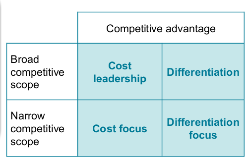

### Economies of scale

less cost overhead and more efficient production with time.

### Preferential access to factors of production

A firm with a high production volume may use its market share to obtain discounts on factors of production.

### Technological advantage

can be independent of eco of scale. come from investment in own research and development. typically from proprietary manufacturing technologies.

### Sounces of differentiation as competitive advantage

- **Product features and innovation**: Quality, Design, Color, Style, Trademarks, Patented feature
- **Links between functions**: Sales with after sales services, distribution or financing, ...
- **Timing**: firstmover introduces, second mover responds, late move responds very late
- **Location and presence**: can be located close to suppliers, distributors, customers, online presence
- **Product mix**: Different products especially if technologically linked.
- **Links with other firms**: Collude with other firms
- **Brand reputation**: Reputation with customers/suppliers, Brand name, _Perceptions_ of product quality/durability/reliablity

## Value Proposition

- Value Prop consists of: **Who needs? What's needed? Price?**
- value proposition defines kind of value company creates for customers. (unique to other competitors' value propositions)
- 'what's needed' often primary decision, leads to answer of other questions.

### Value Chain

The **value chain** is the sequence of all activities involved in value creation and cost generation. It is tailored to a firm’s unique value proposition.
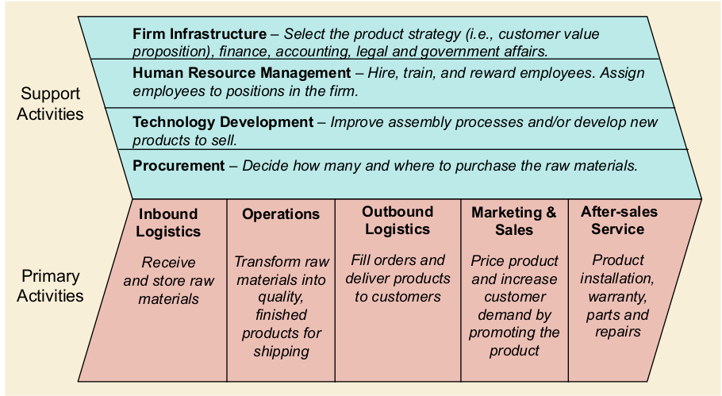

#### Distinctive Value Chain

- choosing how to be different
- making clear tradeoffs

#### Fit across value chain

- integrating activity choices in value chain to fit and reinforce together
- mutually reinforced activities are hard to imitate

#### Value Chain Analysis

- Identify key activities (most customer value or highest cost)
- Identify fit between activites: dense map -> strong fit of activities -> strong competitive advantage

### Strategic management

Analysis and strategic thinking -> Strategic Planning -> Execution and daily management

#### Analysis

Internal: analyze resources/capabilities required to compete with the tools: SWOT, Value chain analysis

External: Environment and industry with: PESTEL, five forces

#### PESTEL

The PESTEL framework offers a systematic way for analyzing environmental factors and how they influence the industry, the strategic group and the firm
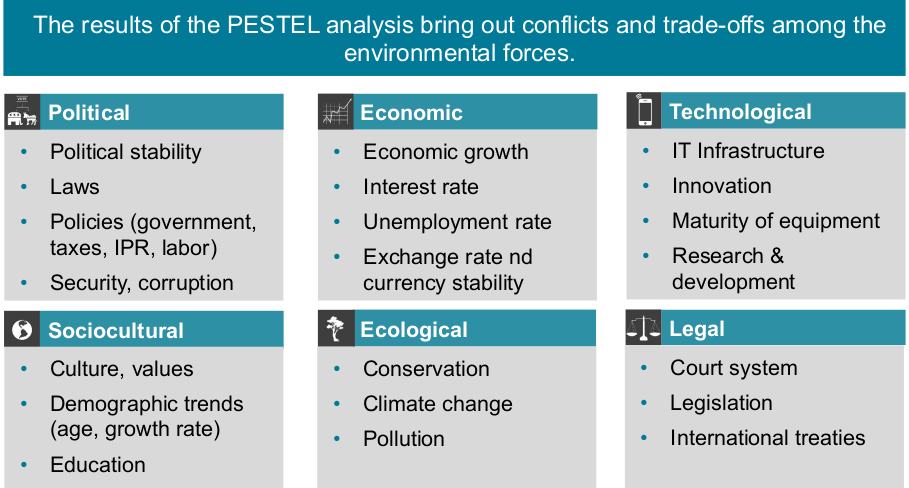

#### SWOT

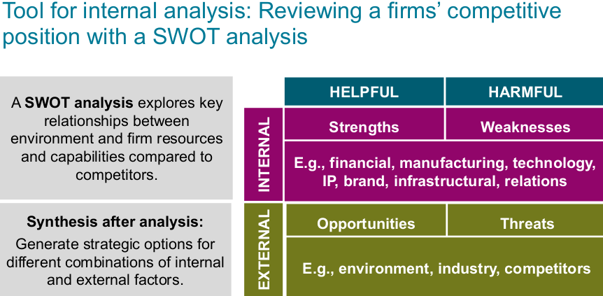

#### Strategy formulation

- **closed form**: responsibility of CEO and top management (is secret)

- **open strategy form**: involvement of empl., stakeholders, ...

<!-- todo: p.44>
# Session 4

## the 2 Effs

- **Effectiveness**: degree of success in producing desired result (_Doing the right things_)
- **Efficiency**: achieving maximum productivity with minimum wasted effort. (_Doing things right_)

_Customer directly cares about effectiveness and indirectly about efficiency_

## Basic goal of POM (Product and Operations Management)

- **Repeatable**
- **Consistent**
- **Reliable**

**60s companies**: Operations has _nothing_ to do with strategy. It's the acting part, concerned with operational and tactical levels.
**C. Wickham Skinner**: Manufacturing is "missing link" in corp. strategy. You _can_ compete through manufacturing.

**POM**:

- the activity of managing resources of the organization that transform input into output and delivers goods and services
- at heart of any business
- covers business process transforming input to output and deliver products to customers
- concerne with the productivity of technology, people and processes
- not only important in manufacturing but also service sector

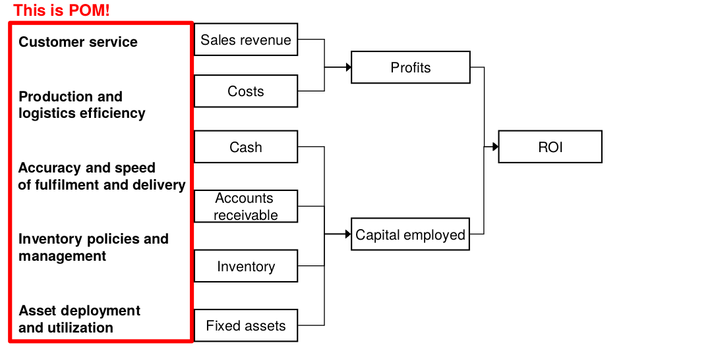

### Operations strategy

total pattern of decisions which shape long-term capabilities of any type of operation and contribution to overall strategy, through reconciliation of market requirements with operations resources.

#### Key Elements

- **competitive priorities**: _priorities/capabilities_ to support competitive advantage.
- **Production system**: design of manufacturing _process_
- **Strategic decision areas**: The _structure_ and _infrastructure_ of the operations

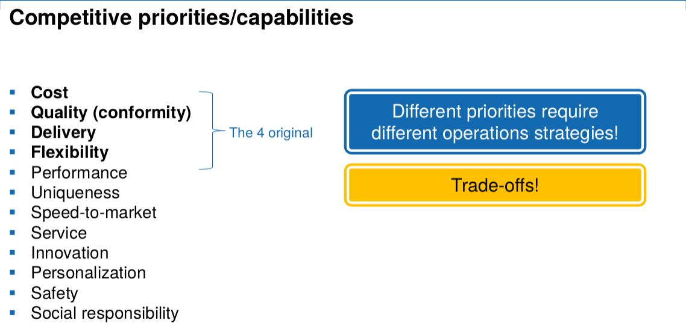

<!-- todo p.21-->

### SIPOC

**S**upplier
**I**nputs
**P**rocess
**O**utputs
**C**ustomer

## Capacity management

**Capacity**: throughput of products/services
**Why important?**: capacity planning has large impact on performance.

- **Average flow time**: time one unit start to finish.
- **Average inventory**: how many units in process
- **Average flow rate**: how many units leave system

#### Little's Law

avg inv. = avg flow time x avg flow rate

cool because:

- always holds (sequencing and variability do not matter)
- no need for empirical evidence (mathemtical law)
- helps to simplify

#### Inventory turns (= 1/"flow time")

important but not everything.

## Process Types

- **Engineer-to-Order** (ETO): from drawing board
- **Make-to-Order** (MTO): particular to customer spec
- **Assemble-to-Order** (ATO): build-sub-assemblies in advance, assemble them for final product
- **Make-to-Stock** (MTS): mass production

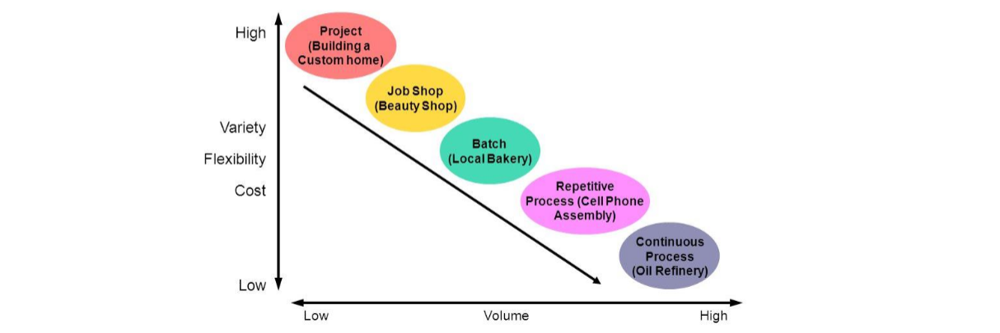

### Customer Order Decoupling Point (CODP)

Seperates order-driven activities from forecast-driven activities.

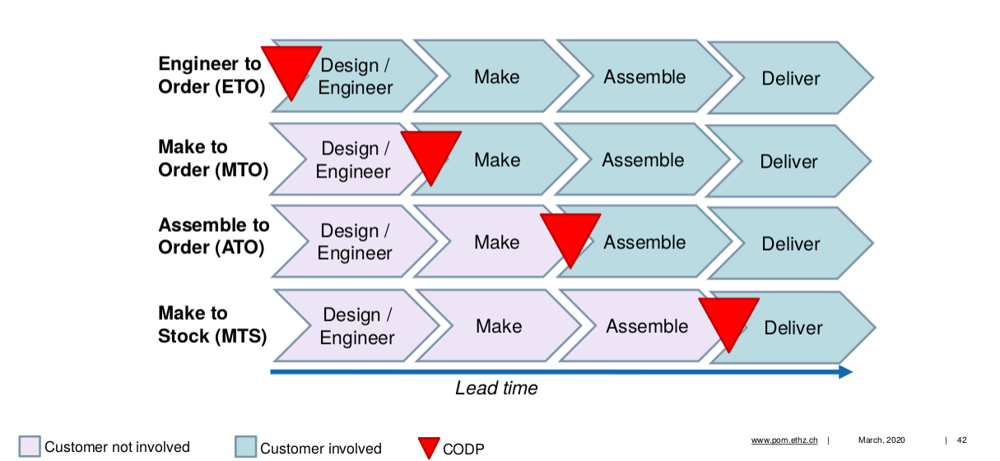
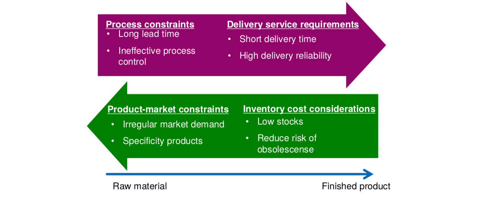

## Strategic Decision Areas

#### Infrastructural

- Planning and control
- Quality
- Work organization
- Human resources
- New product development
- Performance measurement

#### Structural

- Facilities
- Capacity
- Process technology
- Supply network

<!--TODO p.48-->
# Session 5

## Sustainability

#### UN Sustainable Development Goalds (SDGs)

- No Poverty
- Zero Hunger
- Good Health and Well-being
- Quality Education
- Gender Equality
- Clean Water and Sanitation
- Affordable and Clean Energy
- Decent Work and Economic Growth
- Industry, Innovation, and Infrastructure
- Reducing Inequality
- Sustainable Cities and Communities
- Responsible Consumption and Production
- Climate Action
- Life Below Water
- Life On Land
- Peace, Justice, and Strong Institutions
- Partnerships for the Goals

**Corporate Sustainability**: management paradigm, companies engage in activities consistent with sustainable development
**Competitive Advantage**: activities which allow for survival in long run

=> Companies become more sustainable by maximizing intersection of these activities

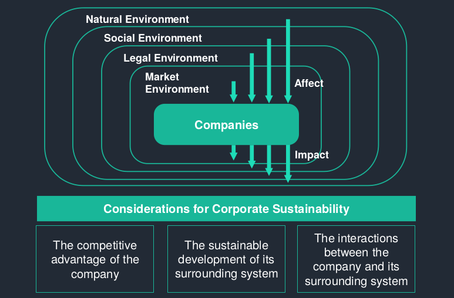

Many similar concepts as corporate sustainability:

|                                 | Idea                                                                                                           | Example                                        |
| :------------------------------ | :------------------------------------------------------------------------------------------------------------- | :--------------------------------------------- |
| Corporate Governance            | prevent abuse of power within organization to protect shareholders                                             | Prevention of accounting fraud                 |
| Corporate Citizenship           | Company engages in protection and support of social, civil and political rights                                | Support of gay rights                          |
| Corporate philantropy           | Funding initiatives that contribute to health, education or protection of the environment outside the business | Gates Foundation funds cancer research         |
| Corporate Social responsibility | Voluntary activities that contribute to health, education protection of environment                            | Offer fathers extra holiday for parental leave |

## Waves of corporate sustainability

#### First wave

Rejection and non-responsiveness (i.e. Opposition [actively] and Ignorance [passively])

- exploit all resources for economic gains
- Do not incorporate sustainability issues into corporate decision making
- Deny impact of activities
- Expect communities to cover costs

#### Second wave

Compliance [Risk], efficiency [Cost] and strategic pro-activity [Competitive advantage]

Risk:

- focus on reducing risk of sanctions etc.
- Follow route of compliance to maintain image of good citizenship

Cost:

- Consider environmental management as a source of avoidable cost
- Implement monitoring to generate higher efficiency
- Increase productivity by raising employees' commitment for sustainability

Competitive advantage:

- Focus on innovation
- Seek stakeholder engagement to be eco-friendly
- Advocate good citizenship to increase attraction and retention of customers etc. to maxyimize profits

#### Third wave

Sustaining corporation (transformation):

- re-interpret the purpose of the firm as part of society in its ecological context
- Support sustainability through society
- Sustainability vital for assessing corporate success

### Freeman vs. Friedman

**Freeman**: Stakeholder theory (balance interest of shareholder's to other stakeholders') -- If a firm creates value for its stakeholders, it will create value for its hareholders.

**Friedman**: Shareholder theory (maximize shareholder value) -- engaging in social development will waste wealth negatively affecting society in the long run. leave it to government.

## Sustainability as integral part of business model

#### The activist company

“One of the most responsible things we can do as a company is to make high-quality stuff that lasts for years and can be repaired, so you don’t have to buy more of it.”

### De-growth as possible strategy for future?

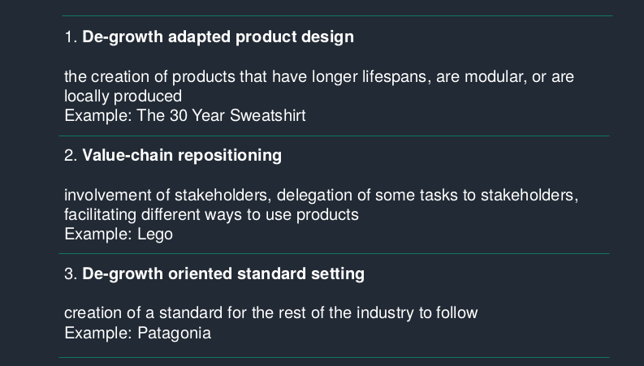

## Key Take-aways

#### Corporate sustainability

What is corporate sustainability and what is the importance of integrating sustainability into core business activities?

#### 3 waves - 3 approaches to sustainability

Companies may change their organization and strategy in an incremental or radical approach. What are the impacts of such approaches?

#### Transformative growth or de-growth?

How can companies take a transformative role to address sustainability issues? Is de-growth a potential path?
# Session 6

## Technology and Innovation Management

### Technology and long term growth

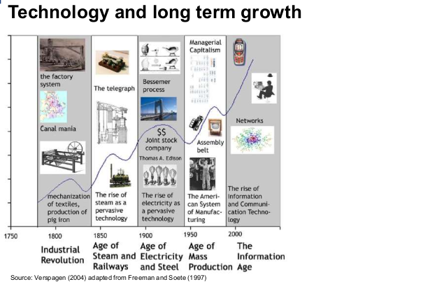
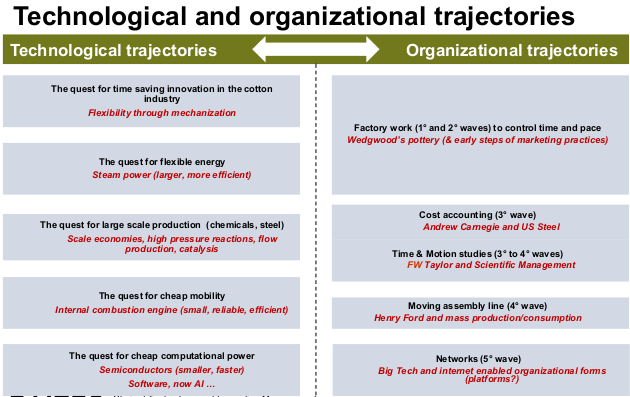

### Invention vs. Innovation

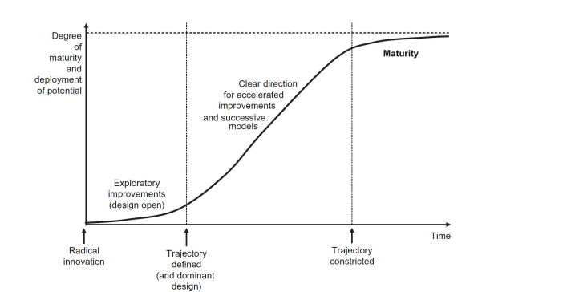
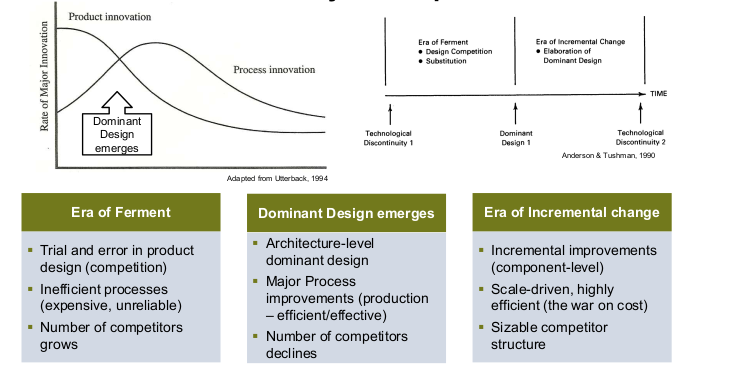

### Different types of innovation

**Novelty Difference**: Radical <==> Incremental
**Input/Output**: Product <==> Process
**Scope**: Architecture <==> Component

### Sources of innovation

Trend: Less Research more Development
=> Is this a problem?

- No, assumption corporations become more Development specialists because of reliance of alternative sources
<!--TODO p.15-->

### Market pull

- **Desirability** (Human)
- **Viablity** (Business)
- **Feasibility** (Technology)

two basic innovation models
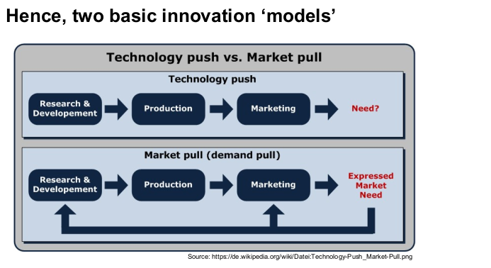

### Organizing for innovation and change

**Exploitation**: Improving existing products

- Refinement, production, efficiency, implementation ...
- Returns from exploitation are reliably linked to the time and place in which they take place.

**Exploration**: creating new products

- Variation, risk taking, experimentation, play, flexibility ...
- Returns from exploration are uncertain, more remote in time, and organizationally distant from the locus of action and adaptation

### Ambidexterity

**Def**: ability to simultaneously pursue incremental and discontinuous innovation

#### Structural ambidexterity

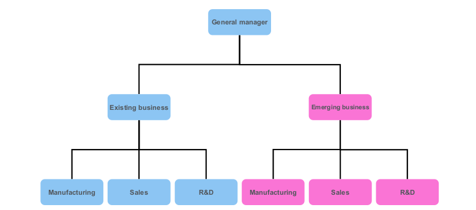

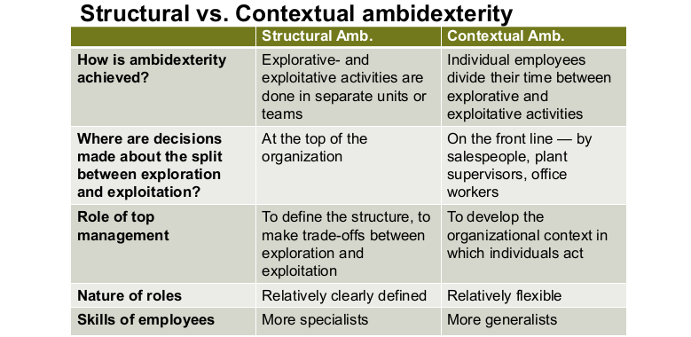

```
“Design thinking is a human-
centered approach to innovation
that draws from the designer's toolkit
to integrate the needs of people,
the possibilities of technology, and
the requirements for business success.”
```

### Convergent Thinking vs. Divergent Thinking

#### Convergent (exploitation)

- using logic
- get answers
- FACTS
- Learning, reward perception, memory, persistence

#### Divergent (exploration)

- using imagination
- get questions
- IDEAS
- Attention control regions, planning, idea generation
<!-- Maybe todo thinking patterns-->
