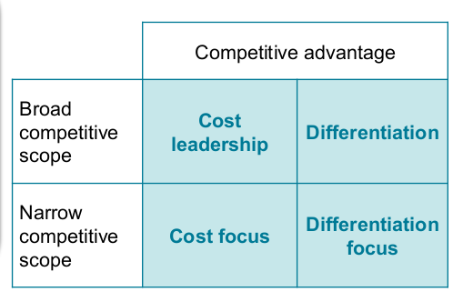
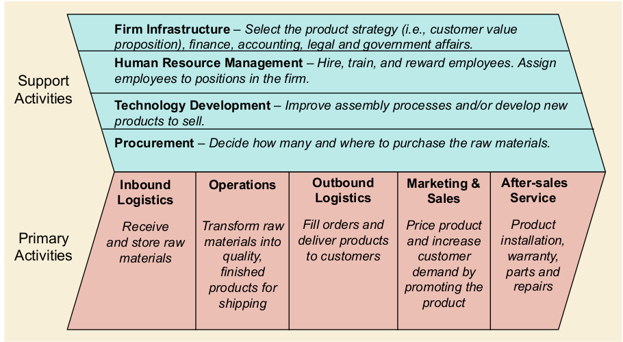
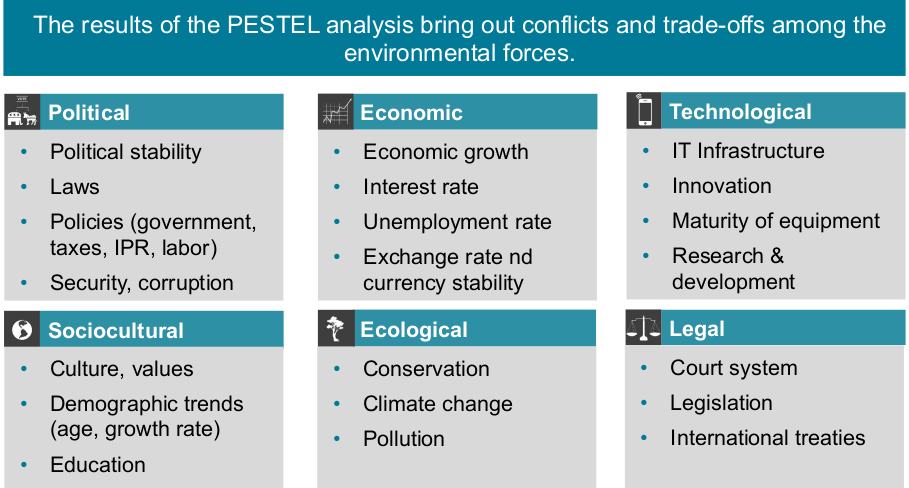
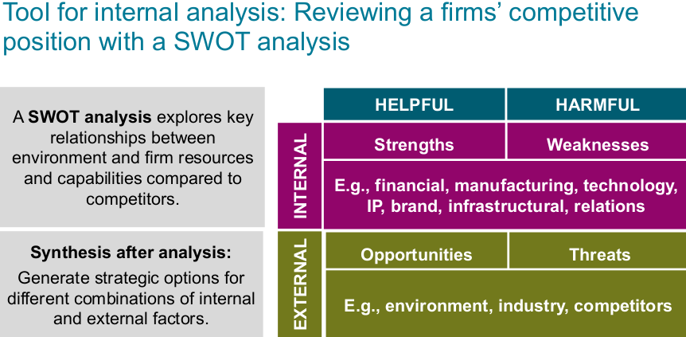

# Session 3

## Competitive Strategy

### Corporate level

**Corporate strategy**: Company with multiple businesses

### Business level

**Competitive strategy**:

- Compete in one business.
- Set of integrated choices defining how a firm achieve sutainably superior performance
  **Key Questions**:
- Why some outperform others financially?
- how survive in short and long term
- where does success of company come from

### Functional level

Innovation strategy, Operations strategy, Marketing strategy...

## Industry Structure

### Fundamentals

**Five Forces** (Framework):

- Suppliers
- Buyers
- New entrants
- Substitutes
- Competitors

If they are strong prices low, and costs high, else vice-versa

_Limitations of Five Industry Analysis_: Additional drivers of industry profitability besides 5 forces:

- Technology
- Government regulation
- Cooperation
- Changes over time

**Competitive Advantage**:
_Def._: firm's ability to create large gap between cost and price

_Drivers_: created by mere effective or distinctive activities compared to rivals.

_Cost leadership_: cost and price cheaper than competition
_Differentiation_: unique features (value-enhancing features)

### Strategic positioning

### Economies of scale

less cost overhead and more efficient production with time.

### Preferential access to factors of production

A firm with a high production volume may use its market share to obtain discounts on factors of production.

### Technological advantage

can be independent of eco of scale. come from investment in own research and development. typically from proprietary manufacturing technologies.

### Sounces of differentiation as competitive advantage

- **Product features and innovation**: Quality, Design, Color, Style, Trademarks, Patented feature
- **Links between functions**: Sales with after sales services, distribution or financing, ...
- **Timing**: firstmover introduces, second mover responds, late move responds very late
- **Location and presence**: can be located close to suppliers, distributors, customers, online presence
- **Product mix**: Different products especially if technologically linked.
- **Links with other firms**: Collude with other firms
- **Brand reputation**: Reputation with customers/suppliers, Brand name, _Perceptions_ of product quality/durability/reliablity

## Value Proposition

- Value Prop consists of: **Who needs? What's needed? Price?**
- value proposition defines kind of value company creates for customers. (unique to other competitors' value propositions)
- 'what's needed' often primary decision, leads to answer of other questions.

### Value Chain

The **value chain** is the sequence of all activities involved in value creation and cost generation. It is tailored to a firm’s unique value proposition.

#### Distinctive Value Chain

- choosing how to be different
- making clear tradeoffs

#### Fit across value chain

- integrating activity choices in value chain to fit and reinforce together
- mutually reinforced activities are hard to imitate

#### Value Chain Analysis

- Identify key activities (most customer value or highest cost)
- Identify fit between activites: dense map -> strong fit of activities -> strong competitive advantage

### Strategic management

Analysis and strategic thinking -> Strategic Planning -> Execution and daily management

#### Analysis

Internal: analyze resources/capabilities required to compete with the tools: SWOT, Value chain analysis

External: Environment and industry with: PESTEL, five forces

#### PESTEL

The PESTEL framework offers a systematic way for analyzing environmental factors and how they influence the industry, the strategic group and the firm

#### SWOT

#### Strategy formulation

- **closed form**: responsibility of CEO and top management (is secret)

- **open strategy form**: involvement of empl., stakeholders, ...

<!-- todo: p.44>
