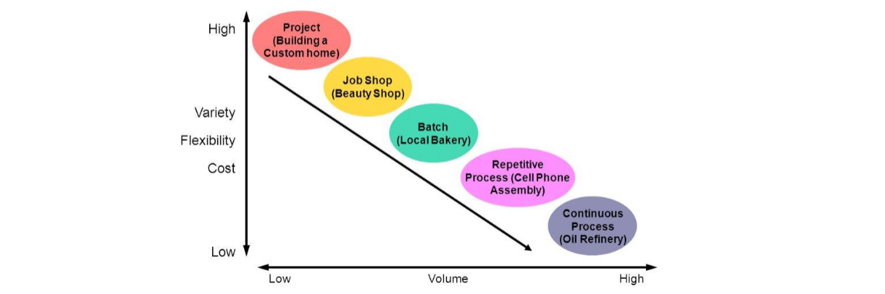

# Session 4

## the 2 Effs

- **Effectiveness**: degree of success in producing desired result (_Doing the right things_)
- **Efficiency**: achieving maximum productivity with minimum wasted effort. (_Doing things right_)

_Customer directly cares about effectiveness and indirectly about efficiency_

## Basic goal of POM (Product and Operations Management)

- **Repeatable**
- **Consistent**
- **Reliable**

**60s companies**: Operations has _nothing_ to do with strategy. It's the acting part, concerned with operational and tactical levels.
**C. Wickham Skinner**: Manufacturing is "missing link" in corp. strategy. You _can_ compete through manufacturing.

**POM**:

- the activity of managing resources of the organization that transform input into output and delivers goods and services
- at heart of any business
- covers business process transforming input to output and deliver products to customers
- concerne with the productivity of technology, people and processes
- not only important in manufacturing but also service sector

### Operations strategy

total pattern of decisions which shape long-term capabilities of any type of operation and contribution to overall strategy, through reconciliation of market requirements with operations resources.

#### Key Elements

- **competitive priorities**: _priorities/capabilities_ to support competitive advantage.
- **Production system**: design of manufacturing _process_
- **Strategic decision areas**: The _structure_ and _infrastructure_ of the operations

<!-- todo p.21-->

### SIPOC

**S**upplier
**I**nputs
**P**rocess
**O**utputs
**C**ustomer

## Capacity management

**Capacity**: throughput of products/services
**Why important?**: capacity planning has large impact on performance.

- **Average flow time**: time one unit start to finish.
- **Average inventory**: how many units in process
- **Average flow rate**: how many units leave system

#### Little's Law

avg inv. = avg flow time x avg flow rate

cool because:

- always holds (sequencing and variability do not matter)
- no need for empirical evidence (mathemtical law)
- helps to simplify

#### Inventory turns (= 1/"flow time")

important but not everything.

## Process Types

- **Engineer-to-Order** (ETO): from drawing board
- **Make-to-Order** (MTO): particular to customer spec
- **Assemble-to-Order** (ATO): build-sub-assemblies in advance, assemble them for final product
- **Make-to-Stock** (MTS): mass production

### Customer Order Decoupling Point (CODP)

Seperates order-driven activities from forecast-driven activities.

## Strategic Decision Areas

#### Infrastructural

- Planning and control
- Quality
- Work organization
- Human resources
- New product development
- Performance measurement

#### Structural

- Facilities
- Capacity
- Process technology
- Supply network

<!--TODO p.48-->
