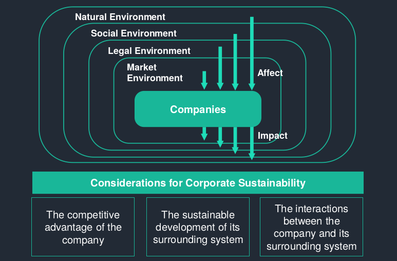
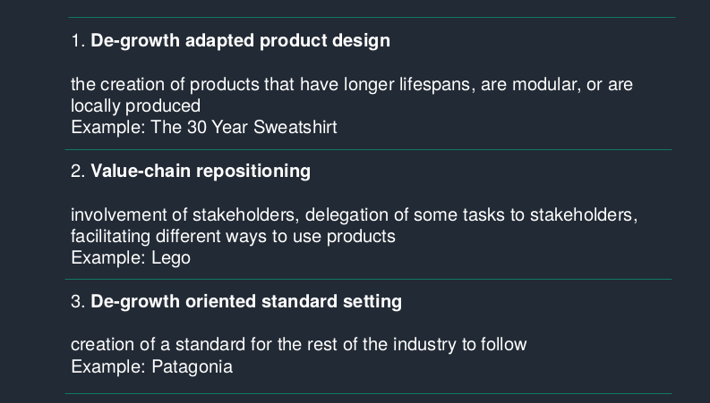

# Session 5

## Sustainability

#### UN Sustainable Development Goalds (SDGs)

- No Poverty
- Zero Hunger
- Good Health and Well-being
- Quality Education
- Gender Equality
- Clean Water and Sanitation
- Affordable and Clean Energy
- Decent Work and Economic Growth
- Industry, Innovation, and Infrastructure
- Reducing Inequality
- Sustainable Cities and Communities
- Responsible Consumption and Production
- Climate Action
- Life Below Water
- Life On Land
- Peace, Justice, and Strong Institutions
- Partnerships for the Goals

**Corporate Sustainability**: management paradigm, companies engage in activities consistent with sustainable development
**Competitive Advantage**: activities which allow for survival in long run

=> Companies become more sustainable by maximizing intersection of these activities

Many similar concepts as corporate sustainability:

|                                 | Idea                                                                                                           | Example                                        |
| :------------------------------ | :------------------------------------------------------------------------------------------------------------- | :--------------------------------------------- |
| Corporate Governance            | prevent abuse of power within organization to protect shareholders                                             | Prevention of accounting fraud                 |
| Corporate Citizenship           | Company engages in protection and support of social, civil and political rights                                | Support of gay rights                          |
| Corporate philantropy           | Funding initiatives that contribute to health, education or protection of the environment outside the business | Gates Foundation funds cancer research         |
| Corporate Social responsibility | Voluntary activities that contribute to health, education protection of environment                            | Offer fathers extra holiday for parental leave |

## Waves of corporate sustainability

#### First wave

Rejection and non-responsiveness (i.e. Opposition [actively] and Ignorance [passively])

- exploit all resources for economic gains
- Do not incorporate sustainability issues into corporate decision making
- Deny impact of activities
- Expect communities to cover costs

#### Second wave

Compliance [Risk], efficiency [Cost] and strategic pro-activity [Competitive advantage]

Risk:

- focus on reducing risk of sanctions etc.
- Follow route of compliance to maintain image of good citizenship

Cost:

- Consider environmental management as a source of avoidable cost
- Implement monitoring to generate higher efficiency
- Increase productivity by raising employees' commitment for sustainability

Competitive advantage:

- Focus on innovation
- Seek stakeholder engagement to be eco-friendly
- Advocate good citizenship to increase attraction and retention of customers etc. to maxyimize profits

#### Third wave

Sustaining corporation (transformation):

- re-interpret the purpose of the firm as part of society in its ecological context
- Support sustainability through society
- Sustainability vital for assessing corporate success

### Freeman vs. Friedman

**Freeman**: Stakeholder theory (balance interest of shareholder's to other stakeholders') -- If a firm creates value for its stakeholders, it will create value for its hareholders.

**Friedman**: Shareholder theory (maximize shareholder value) -- engaging in social development will waste wealth negatively affecting society in the long run. leave it to government.

## Sustainability as integral part of business model

#### The activist company

“One of the most responsible things we can do as a company is to make high-quality stuff that lasts for years and can be repaired, so you don’t have to buy more of it.”

### De-growth as possible strategy for future?

## Key Take-aways

#### Corporate sustainability

What is corporate sustainability and what is the importance of integrating sustainability into core business activities?

#### 3 waves - 3 approaches to sustainability

Companies may change their organization and strategy in an incremental or radical approach. What are the impacts of such approaches?

#### Transformative growth or de-growth?

How can companies take a transformative role to address sustainability issues? Is de-growth a potential path?
