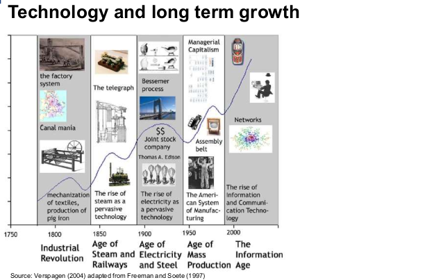
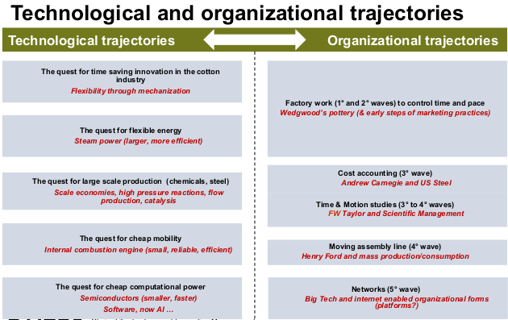
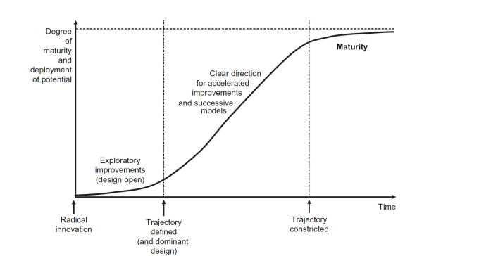
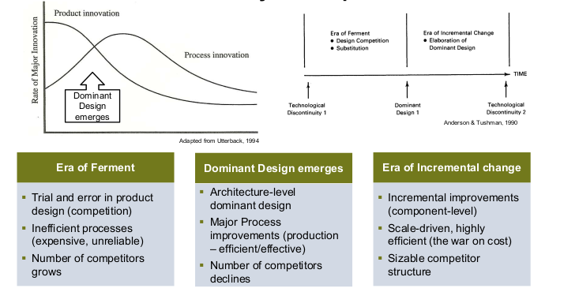
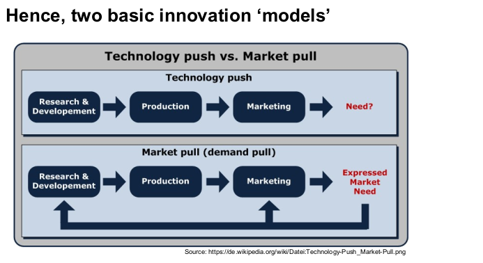
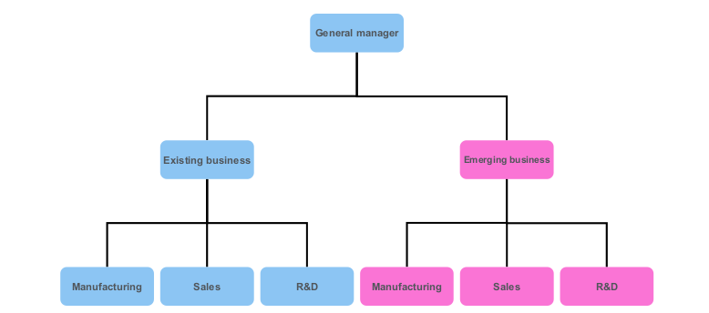
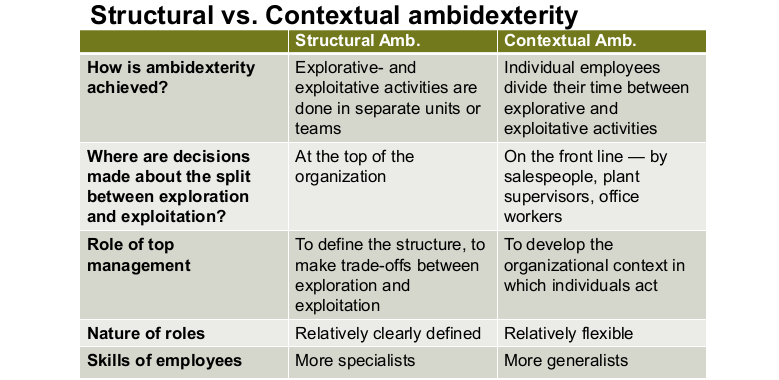

# Session 6

## Technology and Innovation Management

### Technology and long term growth




### Invention vs. Innovation




### Different types of innovation

**Novelty Difference**: Radical <==> Incremental
**Input/Output**: Product <==> Process
**Scope**: Architecture <==> Component

### Sources of innovation

Trend: Less Research more Development
=> Is this a problem?

- No, assumption corporations become more Development specialists because of reliance of alternative sources
<!--TODO p.15-->

### Market pull

- **Desirability** (Human)
- **Viablity** (Business)
- **Feasibility** (Technology)

two basic innovation models


### Organizing for innovation and change

**Exploitation**: Improving existing products

- Refinement, production, efficiency, implementation ...
- Returns from exploitation are reliably linked to the time and place in which they take place.

**Exploration**: creating new products

- Variation, risk taking, experimentation, play, flexibility ...
- Returns from exploration are uncertain, more remote in time, and organizationally distant from the locus of action and adaptation

### Ambidexterity

**Def**: ability to simultaneously pursue incremental and discontinuous innovation

#### Structural ambidexterity





```
“Design thinking is a human-
centered approach to innovation
that draws from the designer's toolkit
to integrate the needs of people,
the possibilities of technology, and
the requirements for business success.”
```

### Convergent Thinking vs. Divergent Thinking

#### Convergent (exploitation)

- using logic
- get answers
- FACTS
- Learning, reward perception, memory, persistence

#### Divergent (exploration)

- using imagination
- get questions
- IDEAS
- Attention control regions, planning, idea generation
<!-- Maybe todo thinking patterns-->
